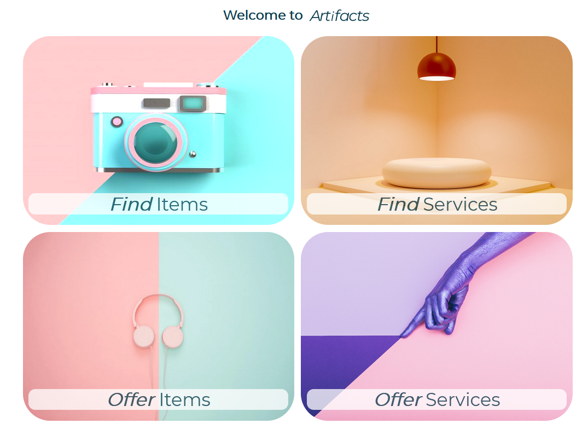

## Overview
**Artifacts** - Born from an idea to provide the Berlin creative and art scene with a web app to make borrowing artists equipment easy and accessible using its own currency, the product concept has quickly developed into a platform for buying and selling second-hand items, as well as giving and obtaining them for free, thanks to critical user research and survey. Artifacts allows users to post, search and manage items and to contact the current owners.

In addition to functionalities such as user login via an existing Google account, an extensive search mask for finding items and an editable user profile, Artifacts also allows users to create and delete their own items and save favorites. With the connection to a Google Firebase Realtime Database the information is stored securely and can be retrieved at a later session.

This repo is part of the TechLabs Berlin summer 2021 Project Phase.

## Take a look at Artifacts
Please visit [Artifacts](https://artifacts-effcb.web.app/) and log in with an existing Google account.

## Project status
This repo is part of the TechLabs Berlin summer 2021 Project Phase. The project ends with submission on 11th of Juli 2021.
No further activities are planned for the future.

## Description
* If you like to have an introduction to and a description on Artifacts, watch our [video](https://youtu.be/p2EWyoVflWI).
* Find detailed information on the **UX/UI part** of the project in the UX folder and the UX README. 

## Tech Stack
* React & Hooks
* React Router
* eslint

* SCSS

* Webpack

* Firebase Realtime Database
* Firebase Authentication
* Firebase Hosting

* GitHub workflows (CI/CD)

* EmailJS.com

## Installation
* first you have to set up your project Firebase Realtime Database and
* save the key.js in the WD-folder (see example - key.js)
* run _yarn install_ on the WD folder to install all necessary packages

* run the dev-server with _yarn dev-server_
* hint: run _yarn lint:fix_ to make your code pretty :)

## What could be next?
We had many ideas but too less time for e.g.:
* _Find & Offer Services_ analogous _Find & Offer Items_
* Messenger/chat for communication between users
* Show availability and Location/Map/Around Me
* Show other users profile
* Dynamic rating of other users
* Picture upload and storage
* Dynamic number of fans per item
* Updating item information with update of user information (name, picture, rating)
* ...

## Authors and acknowledgment
Many thanks to all TechLabs team members and to our wonderful mentor as well as the whole TechLab community.
Thank you for having us.

* mentored by Renan Bandeira: [renanbandeira](https://github.com/renanbandeira)

* Eunice Abieyuwa Igbinedion (WD): [Eunnylans](https://github.com/Eunnylans)
* Kati (Ekaterina Atanasova) (UX): [ekaterina22](https://github.com/ekaterina22)
* Luciana Serna (WD): [sernawills](https://github.com/sernawills)
* Pika Stih (UX): [pikastih](https://github.com/pikastih)
* Stefanie Zastrow (WD): [SteffiZ-0-0](https://github.com/SteffiZ-0-0)
* Terence Li (UX): [terenlih](https://github.com/terenlih)

## License
* MIT
