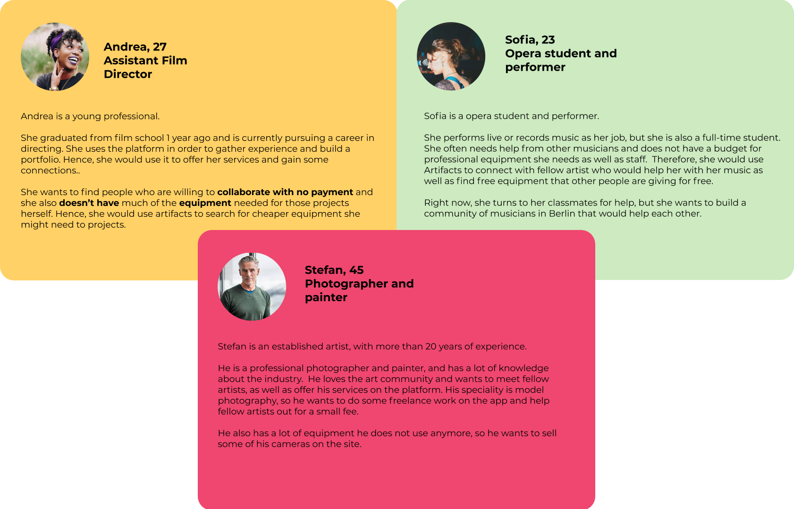
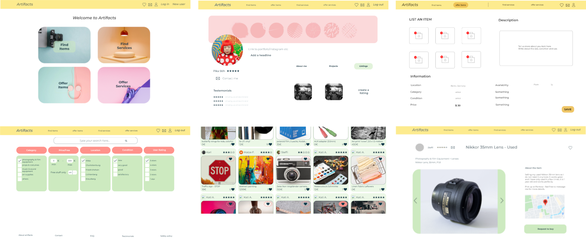

**Artifacts** - Born from an idea to provide the Berlin creative and art scene with a web app to make borrowing artists equipment easy and accessible using its own currency, the product concept has quickly developed into a platform for buying and selling second-hand items, as well as giving and obtaining them for free, thanks to critical user research and survey. Artifacts allows users to post, search and manage items and to contact the current owners.

In addition to functionalities such as user login via an existing Google account, an extensive search mask for finding items and an editable user profile, Artifacts also allows users to create and delete their own items and save favorites. With the connection to a Google Firebase Realtime Database the information is stored securely and can be retrieved at a later session.

In the summer term 2021 of TechLabs Project Phase our team of 3 UX-Techies and 3 Front End Web Devs actively applied and deepened their acquired knowledge, gained while TechLabs Academic Phase, and developed a functioning, responsive and user friendly prototype, while having fun!

&nbsp;

---

&nbsp;

**Problem** - Berlin is known as the cultural capital of Germany. According to official statistics, there are over 20,000 registered artists currently working and living in Berlin, and more than 160,000 people are employed in the cultural and creative sector. We see a need for artists and creatives to exchange resources and collaborate with each other. Meanwhile, there are some online platforms in Berlin for equipment rental (e.g. [Beazy](https://www.beazy.co/de/legal) or [Ebay Kleinanzeigen](https://www.ebay-kleinanzeigen.de/)) and for collaborations (e.g. [Crew United](https://www.crew-united.com/en/) and [Schauspielervideos](https://www.schauspielervideos.de/)), but they are mostly catered towards the filmmakers. There is a lack of interdisciplinary platforms to pool together artists and creatives in different fields. As we see a growing trend for cross-disciplinary projects and hybrid forms of art-making, we feel of course a need to build a more centralised platform for our potential users.

We did some quantitative and qualitative research and found out that people are most interested in selling and buying items and equipment from fellow artists, and also finding free items and giving them away for free. Renting equipment is not the most popular functionality since people generally would not trust other people with their equipment and they would rather hire from a secure rental company. On the other hand, another major finding is that potential users are also interested in finding and offering services (collaboration & networking). Therefore, we decided to shift our project from a rental-based site to an all-encompassing platform that allows users to buy/sell/give away items as well as offer services to each other. Based on our research and also interviews with creatives and artists of different ages, fields and backgrounds, and levels of experience, we created different personas and user stories.

&nbsp;

_Picture 1: Personas_

&nbsp;

> _More information:_
> * Please check out our [survey](https://forms.gle/LD3fAVmbDcZ9KwRVA)
> * Please see the [survey findings](https://docs.google.com/spreadsheets/d/1JoJP1Cx502ASWBgaHwifp7GWb9b8fcTAr56v5WMaeHI/edit?usp=sharing)
> * Please see the [survey insights summary](https://docs.google.com/document/d/1wMnTKCd5E3KGYi5myt6gV8PsCjuYjBI2uVb-YSiS2Y4/edit?usp=sharing)
> * Please view the [user stories](https://docs.google.com/document/d/1nmyP5Ggku_0QN8vFED7BpRaZPeu2_fewpYip8O11j4g/edit?usp=sharing)

&nbsp;

**Design Process** - We started to sketch our prototype with the above personas in mind. We came up with sketches on the Invision app, and then moved on to design our wireframes on Figma.

The general Information Architecture (IA) model that we used is the Bento-box model. We believe that we have to present on the landing page very clearly what scope of functionalities we are providing in Artifacts, since the range of services for the creative and art sector could be really wide. The user will be drawn to the four main functionalities (which are neatly fit into a 2x2 grid) once he/she visits our page, namely "find items", "offer items", "find services" and "offer services". To create a more secured experience, the user must first register with their Google accounts before they can access the functionalities.

We decided to go for a neat, simple and cheerful design, which incorporates pastel and more primary colours (yellow, red, green and blue), the Montserrat font which gives a modern and not too serious feel. We avoid sharp corners in our buttons and text boxes, which also contributes to the friendly and cheerful look and feel of the site.

&nbsp;

>_More information:_
> * Please check out our [initial drafts](https://artifacts.invisionapp.com/freehand/artifacts-LyGhP5BNl) on the Invision page 
> * Here is [our project](https://www.figma.com/file/jtk0TxRCG1RomCqNXJ0UCH/artifacts?node-id=0%3A1) on Figma
> * A glimpse to our [brainstorming stye guide & landing page](https://docs.google.com/spreadsheets/d/1gONGSG5pJXhsCugrjvga7DNO4OPIo_amNz64YmqqQQ0/edit#gid=785450853)
> * Check out the [user flows](https://www.figma.com/file/L7tdneL92346KJGOx4Pgut/User-Flows?node-id=0%3A1)

&nbsp;

_Picture 2 (in order of their appearance):_
_Landing page, user profile, offer item page, find items page, items grid, individual item pop-up page_

&nbsp;

To sum up, the UX team has learned a lot during the past 10 weeks from research to design. What we have not achieved is to test out our prototype among more people. However, we believe that we have successfully created a consistent, user-friendly design for our potential users.

&nbsp;

---

&nbsp;

**Coding** - As soon as the Project Phase began, the active work on the project for the web dev team also started. Thanks to the advice of our mentor, the Tech Stack was quickly clarified and we agreed to test our freshly acquired knowledge regarding React and SCSS directly in the project. The first hurdle we had to overcome was the issue of data storage and database. Since our web dev team consisted of three Techies who followed the front end path and we therefore had to tackle the project without a back end Techie, we had to figure out ways of make the back end work. However this meant a lot of learnings for us, and again we were able to rely on the expert advice of our mentor and decided to use Google Firebase for data storage, hosting and the authentication with existing Google accounts.

After the initial set up of the repo, we went straight into creating the first components and making them accessible via the React Router. In parallel, enabling the authentication and the CRUD functionalities interactions with the database was a core focus of our first weeks. At the beginning, we focused mainly on the functionalities of Artifacts in order to have the core features implemented quickly and to give the UX team time to work on wireframes. Using initial sketches, we set up the landing page, the search mechanism and item cards, the header, the user profile and the form for entering new items.

We slowly realized that given the time left it won't be possible to implement the MVP as defined in the first week, without sacrificing quality in the product (and our lifes beside the project 😉). In order to secure our goal of providing a prototype that is harmonious and also works without errors in the offered functionalities, some features of the MVP had to be left out. We therefore continued to focus on Artifacts as an exchange platform for items and postponed the
* extension to services to Release 2.0, followed by
* user rating,
* dynamic display of fans per item,
* messenger functionality,
* functionality to show someones profile
* feature to upload and store pictures (not just URL) and
* other features to make the website more dynamic.

With the final wireframes the UX team provided during the fourth week, we began to implement the restyling of the pages. In parallel, further functionalities were implemented, like the pop over with detailed information about the item clicked and the messaging between users via e-mail.

Thanks to the continuous deployment to Google Firebase of our Github main branch via Github workflows, we were able to comfortable add different sample items to the database during the last two weeks of the Project Phase, so that we could frequently test the behavior and the search algorithm and identify bugs. We can say the last weeks of the Project Phase included mainly bug fixes, restyling and finalizing the last functionalities.

Please visit us on [Artifacts](https://artifacts-effcb.web.app/).

 &nbsp;

---
 
 &nbsp;

We are happy to bring a project of this scope to life within the 10-weeks Project Phase interdisciplinary while having fun and respect for each others needs. Thank you for having us!